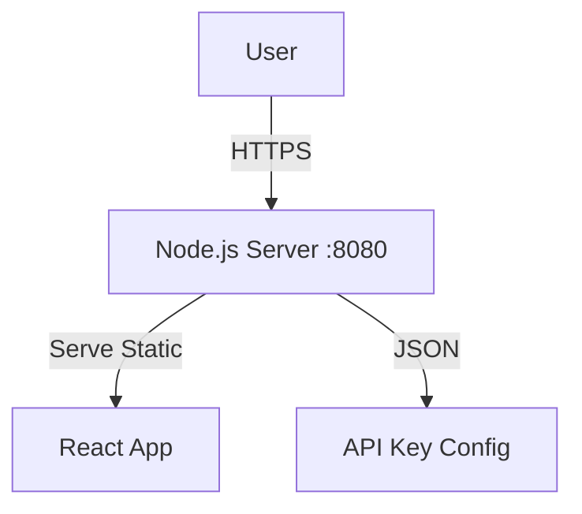
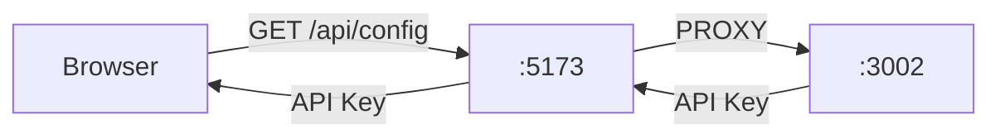

# Scripture Voice AI

A next-generation Bible Podcast application that transforms scripture reading into an immersive auditory and visual experience using Google's latest AI models.

## Architecture & Data Path

This application utilizes a **Hybrid Client-Server Architecture** hosted on Cloud Run.

### The Data Path (Step-by-Step)

Here is exactly what happens when a user opens the app and searches for "John 3:16":

#### Phase A: Initialization (The Handshake)
1.  **Load:** The user visits the URL. `server.js` serves the static `index.html` and React bundle.
2.  **Config Fetch:** On startup, the browser makes a call to `GET /api/config`.
3.  **Secret Delivery:** `server.js` reads the `API_KEY` from Cloud Run's environment variables and sends it to the browser securely (over HTTPS).
4.  **Setup:** The React app initializes the Google GenAI SDK using this key.
5.  **Fallback:** If the server key is missing, the user can manually enter a key in Settings, which saves to `localStorage`.

#### Phase B: The Search (Client-Side AI)
1.  **Input:** User types "John 3:16".
2.  **Check Cache:** The app checks Browser `localStorage`. If found, it loads instantly.
3.  **AI Request:** If not found, the **Browser** sends a request directly to Google's servers (`generativelanguage.googleapis.com`).
4.  **Response:** Google returns the Bible text JSON.
5.  **Cache:** The Browser saves this to `localStorage`.

#### Phase C: The Audio (Client-Side Processing)
1.  **Generation:** The Browser requests audio chunks from Gemini TTS.
2.  **Processing:** The app converts raw PCM data into playable WAV files inside the browser (saving server CPU).
3.  **Playback:** The audio is played via the HTML5 Audio API.

### Architecture Diagram

```mermaid
graph TD
    User[User / Browser]
    Server[Node.js Server (Cloud Run)]
    Gemini[Google Gemini API]
    Storage[Browser LocalStorage]

    %% Initialization
    User -- 1. Request App --> Server
    Server -- 2. Return React App --> User
    User -- 3. GET /api/config --> Server
    Server -- 4. Deliver API Key --> User

    %% Search Flow
    User -- 5. Search Query --> Storage
    Storage -- 6. Cache Miss? --> Gemini
    Gemini -- 7. JSON/Audio Data --> User
    User -- 8. Save Result --> Storage
```

### Local vs. Production Architecture

To make the "Key Manager" work locally, we use a Proxy.

#### 1. Production (Cloud Run)
In production, the app is a **Monolith**. One server does everything.



#### 2. Local Development
We added a bridge (Proxy) so the Frontend talks to the Backend automatically.



## Features

*   **Voice Search**: Find any verse by speaking (e.g., "Love is patient").
*   **Smart Context**: Automatically generates historical and theological background.
*   **Multi-Voice Podcast**: Uses different voices for scripture (Authoritative) vs. devotional content (Pastoral).
*   **Visuals**: AI-generated oil paintings for every verse.
*   **Song Writer**: Composes lyrics based on the scripture.
*   **Offline Support**: Caches content locally and provides a downloadable PDF.

## Deployment Guide

### 1. Prerequisites
*   A Google Cloud Project.
*   A Gemini API Key from [Google AI Studio](https://aistudio.google.com/).

### 2. Configure API Key (Critical)
For the app to work for public users, you must set the `API_KEY` environment variable on the server.

**Via Command Line (Cloud Shell):**
```bash
gcloud run services update scripture-voice --update-env-vars API_KEY=AIzaSy...YourKey --region us-west1
```

**Via Cloud Console:**
1.  Go to Cloud Run.
2.  Select your service.
3.  Click **Edit & Deploy New Revision**.
4.  Go to **Variables & Secrets**.
5.  Add Variable: `API_KEY` with your value.
6.  Deploy.

### 3. Local Development
To run the app locally with full backend features:

1.  Create a `.env` file:
    ```
    API_KEY=your_api_key_here
    PORT=3002
    ```
2.  Run the development server:
    ```bash
    npm run dev
    ```
    *(This runs both the Node backend on port 3002 and the Vite frontend on port 5173, connected via Proxy)*

## Source Code
[https://github.com/Shengliang/aistudio](https://github.com/Shengliang/aistudio)
